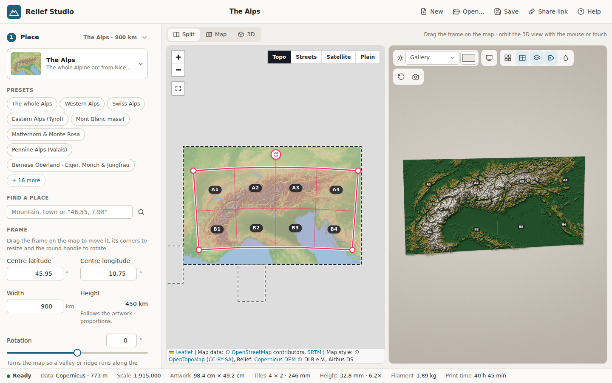

# Relief Studio – 3D-printable relief maps of the Alps (and beyond)

Relief Studio turns real elevation data into **tiled, 3D-printable relief maps** that you print
on an ordinary FDM printer and assemble into a piece of wall art.



* **Pick an area** of the Alps – or one of 20 other mountain ranges, or anywhere on Earth with live
  data – by dragging, resizing and rotating a frame on the map. 100+ presets such as
  *Matterhorn & Monte Rosa*, *Dolomites*, *Mount Everest* or *The whole Alps*.
* **Split it for your printer.** Choose your printer (28 presets or custom) and the tile grid; every
  tile fits the bed, and the grid is shown on the map and in 3D. Neighbouring tiles share their edge
  heights, so the terrain continues seamlessly across the joints.
* **See how it will look** – a 3D preview of the piece hanging on your wall, in **your own
  filaments**: colour changes at layer heights, matte / silk / marble / wood finishes, gallery,
  morning, evening or raking light, exploded view, FDM layer lines.
* **Seven art styles**: classic relief, terraced contours, low-poly facets, ridgelines
  (“Unknown Pleasures”), hexagonal columns, engraved contour lines and a backlit lithophane.
* **Know what it costs**: filament per colour and per tile (grams, metres, spools), print time and
  cost, plus the exact layer at which to swap filament.
* **Export watertight STL or 3MF files** for every tile (3MF optionally carries PrusaSlicer colour
  changes), with engraved tile labels and optional magnet pockets on the back, plus a printable
  **print & assembly plan**.

Everything runs locally in your browser. There is no backend; the heavy lifting happens in a Web
Worker.

## Quick start

```bash
git clone https://github.com/ArthurKoe/ios-app-dev-skill.git relief-studio
cd relief-studio
npm start            # → http://localhost:4173   (any static file server works, e.g. python3 -m http.server)
```

No build step and no runtime dependencies. Node is only used for the tiny static server and the tests.
To host it, enable GitHub Pages (*Settings → Pages → Source: GitHub Actions*); the included workflow
`.github/workflows/pages.yml` publishes `index.html`, `app/` and `data/`.

## How to use it

1. **Place** – choose a region (grouped by continent) and a preset, search for a place, or drag the
   frame on the map. Its corners resize it (keeping the artwork's proportions), the round handle
   rotates it, so a valley or ridge can run along the artwork.
2. **Printer & tiles** – pick your printer, the tile size (“Max for bed” fills the bed) and the
   number of columns and rows. The status bar shows the artwork size and the map scale.
3. **Relief** – the vertical exaggeration is automatic by default: the highest summit ends up about
   30 mm above the base whatever the area (whole ranges need ~5×, a single massif less than 1×).
   You can set it manually, change the base thickness, the floor elevation, smoothing, how lakes and
   the sea are shown (flat or slightly recessed), the export resolution and the mesh simplification.
4. **Art style** – pick one of the seven styles; each has its own settings. An optional raised border
   frames the whole artwork.
5. **Colours & filament** – tick the filaments you own in the library (or add your own with a colour
   picker), then pick a colour theme or edit the elevation bands yourself. Each band shows the layer
   and height where the slicer must pause for the filament swap.
6. **Back side** – engraved, mirrored tile labels (`A1` is top-left, the arrow points up) and optional
   pockets for round magnets, so the tiles can be mounted on a steel sheet.
7. **Estimate** – filament per colour and per tile, print time, spools and cost for your material,
   infill and printer speed.
8. **Export** – download a zip with one STL or 3MF per tile, the print plan (`print-plan.html`) and the
   project file. Projects autosave in the browser and can be saved as JSON or shared as a link.

Very large prints can also be exported from the command line with the same pipeline:

```bash
node scripts/export.mjs my-project.json --out prints --check      # project saved from the app
node scripts/export.mjs --preset alps "Matterhorn & Monte Rosa" --out prints --format 3mf
```

## Printing & assembly tips

* Print every tile **face up, without supports**. 0.2 mm layers with a 0.4 mm nozzle work well; the
  default export resolution (0.4 mm) matches the nozzle width.
* All tiles share one height scale, so the **colour-change layers are the same for every tile**. Add the
  pauses (M600 / “filament change”) at the layers listed in the band editor or the print plan. The 3MF
  export can pre-fill them for PrusaSlicer (experimental).
* Use the same filament batch for all tiles and enable elephant-foot compensation so the tiles butt
  together cleanly.
* Lay the tiles face down in the order of the engraved labels and glue them onto a backing board
  (plywood or foam board). Alternatively, glue a steel sheet to the wall and use the magnet pockets.
* Lithophanes: print in white PLA, ideally standing upright, and hang them in front of an LED panel.

## Elevation data

The repository ships with preprocessed elevation data (≈470 MB) in `data/`, built from the
[Copernicus DEM](https://dataspace.copernicus.eu/explore-data/data-collections/copernicus-contributing-missions/collections-description/COP-DEM)
(GLO-30 ≈ 30 m and GLO-90 ≈ 90 m) and checked against the original GeoTIFFs. The Alps come at 30 m
for the whole Alpine arc and the surrounding hills (Jura, Black Forest, Apennine and Dinaric edges)
and at 90 m for the rest of the 43–49° N, 4–17° E box.

| Region | Continent | Area | Best resolution | Highest point* | Size | Presets |
|---|---|---|---|---:|---:|---:|
| **The Alps** | Europe | 43°N–49°N, 4°E–17°E | 30 m (mountains), 90 m elsewhere | 4,810 m | 243 MB | 24 |
| Central Himalaya | Asia | 27°N–30°N, 83°E–89°E | 30 m around Everest, 90 m elsewhere | 8,736 m | 50 MB | 6 |
| Karakoram | Asia | 35°N–37°N, 74°E–78°E | 90 m | 8,561 m | 13 MB | 4 |
| Greater Caucasus | Asia | 42°N–44°N, 41°E–46°E | 90 m | 5,616 m | 10 MB | 4 |
| Mount Fuji | Asia | 35°N–36°N, 138°E–139°E | 30 m | 3,768 m | 8 MB | 2 |
| Pyrenees | Europe | 42°N–44°N, 2°W–4°E | 90 m | 3,344 m | 11 MB | 4 |
| Tatra Mountains | Europe | 49°N–50°N, 19°E–21°E | 30 m | 2,602 m | 11 MB | 2 |
| Corsica | Europe | 41°N–43°N, 8°E–10°E | 90 m | 2,647 m | 1 MB | 2 |
| Norwegian Fjords | Europe | 61°N–63°N, 5°E–9°E | 90 m | 2,445 m | 5 MB | 3 |
| Iceland | Europe | 63°N–67°N, 25°W–13°W | 90 m | 2,081 m | 13 MB | 2 |
| Tenerife & Teide | Africa | 28°N–29°N, 17°W–16°W | 30 m | 3,706 m | 2 MB | 2 |
| Kilimanjaro | Africa | 4°S–2°S, 37°E–38°E | 30 m | 5,887 m | 11 MB | 2 |
| Canadian Rockies | North America | 50°N–53°N, 118°W–115°W | 90 m | 3,673 m | 11 MB | 4 |
| Cascade Volcanoes | North America | 46°N–47°N, 123°W–121°W | 30 m | 4,413 m | 12 MB | 3 |
| Sierra Nevada | North America | 36°N–40°N, 121°W–118°W | 30 m around Yosemite, 90 m elsewhere | 4,398 m | 20 MB | 4 |
| Grand Canyon | North America | 35°N–37°N, 114°W–111°W | 30 m along the canyon, 90 m elsewhere | 3,829 m | 17 MB | 3 |
| Alaska Range – Denali | North America | 62°N–64°N, 152°W–149°W | 90 m | 6,169 m | 4 MB | 2 |
| Island of Hawaiʻi | Oceania | 18°N–21°N, 157°W–154°W | 30 m | 4,204 m | 9 MB | 3 |
| Southern Alps (New Zealand) | Oceania | 45°S–42°S, 167°E–172°E | 90 m | 3,639 m | 8 MB | 4 |
| Patagonia | South America | 52°S–48°S, 74°W–72°W | 90 m | 3,574 m | 8 MB | 3 |
| Aconcagua (Andes) | South America | 34°S–32°S, 71°W–69°W | 90 m | 6,905 m | 5 MB | 2 |

\* As represented in the DEM. A 30 m grid smooths sharp summits, so needle peaks such as the
Matterhorn come out up to ~150 m lower than their true height. At print scale this is a fraction of a
millimetre.

Lakes are flat in the Copernicus DEM and the sea is 0 m, so the pipeline derives a water mask that the
app uses to keep lakes flat (or slightly recessed) and to suggest the *Island* colour theme.

**Anywhere else** the app fetches live data from the
[AWS Terrain Tiles](https://registry.opendata.aws/terrain-tiles/) open dataset (internet connection
required); 20 extra presets such as Mount Etna, Lofoten, Table Mountain or Zion National Park are
included.

### Adding or upgrading regions

```bash
pip install -r pipeline/requirements.txt
python3 pipeline/build.py tatra                      # rebuild a predefined region (pipeline/regions.py)
python3 pipeline/build.py --custom my-area "My Area" 46 7 47 9 --glo30 all   # any whole-degree box, 30 m
python3 pipeline/verify.py my-area                   # compare against the source GeoTIFFs
```

Downloads are cached in `.cache/copernicus` (override with `RELIEF_CACHE=/path`). The format is
documented in [docs/DATA_FORMAT.md](docs/DATA_FORMAT.md).

## Development

* Architecture and module contracts: [docs/ARCHITECTURE.md](docs/ARCHITECTURE.md)
* Unit tests (Node 22, no dependencies): `npm test`
* End-to-end tests (Playwright + Chromium): `npm install && npx playwright install chromium && npm run e2e`
* Dev pages for single components: `app/dev/map.html`, `app/dev/preview.html`

```
index.html, app/           the web app (vanilla ES modules, no build step)
  js/core, dem/            projection, RDEM decoding, local + live elevation sources, sampling
  js/model/                layout, height mapping, art styles, tiles, back side (labels, magnets)
  js/mesh/                 watertight solids (Delatin simplification), STL + 3MF writers
  js/catalog/, estimate/   printers, filaments, themes, colour bands, filament/time/cost estimate
  js/engine/               Web Worker pipeline;  js/preview/ three.js;  js/map/ Leaflet;  js/ui/ sidebar
data/                      elevation pyramids (RDEM chunks), overviews, regions.json
pipeline/                  Python data pipeline (download, build, verify)
scripts/                   static server, headless exporter
tests/unit, tests/e2e      Node and Playwright tests
```

## Licences & attribution

* Code: MIT (see `LICENSE`). Vendored libraries keep their own licences (`app/vendor/*/LICENSE`):
  three.js (MIT), Leaflet (BSD-2-Clause), fflate (MIT), Delatin (ISC).
* Elevation data: *Contains modified Copernicus DEM data (GLO-30/GLO-90) © DLR e.V. 2010-2014 and
  © Airbus Defence and Space GmbH 2014-2018, provided under COPERNICUS by the European Union and
  ESA; all rights reserved.* The Copernicus DEM is free to use and redistribute with this attribution.
  Live data: AWS Terrain Tiles (Mapzen; sources include SRTM, GMTED, ETOPO1, NED, EU-DEM and others).
* Base maps: © OpenStreetMap contributors, OpenTopoMap (CC-BY-SA), Esri World Imagery.
